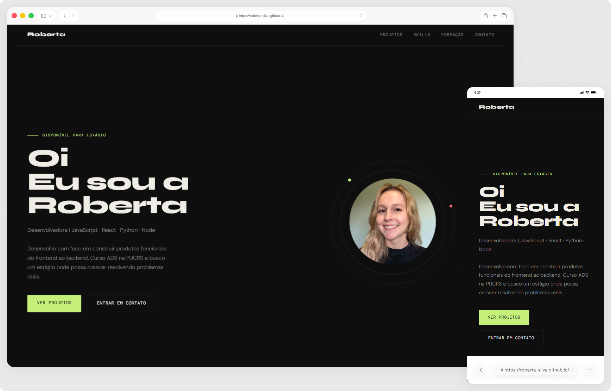

# Portfólio - Roberta da Silva ✨

Meu portfólio pessoal, onde apresento projetos, habilidades técnicas e minha evolução como desenvolvedora frontend. O site está em constante atualização, com novos projetos, melhorias visuais e refatorações sendo adicionados à medida que meu aprendizado avança. Todo o layout e a implementação foram pensados para refletir meu nível técnico atual e meu progresso como desenvolvedora.

> Status do projeto: Concluído ✔️ (em constante evolução)

## Acesse o projeto

🔗 [https://roberta-silva.github.io/](https://roberta-silva.github.io/)  
🔗 [https://robertadasilva.com.br/](https://robertadasilva.com.br/)

## Funcionalidades
- Apresentação de projetos e trabalhos concluídos  
- Exposição de habilidades técnicas e experiência  
- Layout responsivo e acessível  
- Código limpo e semântico  
- Atualizações constantes com melhorias e novos conteúdos  

## Objetivos técnicos
- Estruturação semântica do HTML5  
- Responsividade e adaptabilidade do layout  
- Acessibilidade para diferentes tipos de usuários  
- Boas práticas de frontend e organização de código  
- Uso de Git & GitHub para versionamento e hospedagem  

## Tecnologias
- HTML5  
- CSS3  
- JavaScript (ES6+)  
- Git & GitHub  
- Figma  

## Contato
- LinkedIn: [https://www.linkedin.com/in/robertadasilva/](https://www.linkedin.com/in/robertadasilva/)  
- E-mail: robertadasilva.contato@gmail.com  
> Feedbacks e sugestões são sempre bem-vindos.

## 👀 Preview

